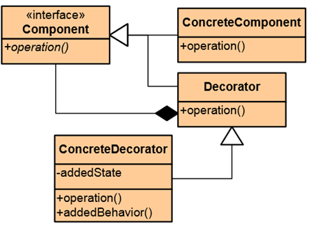
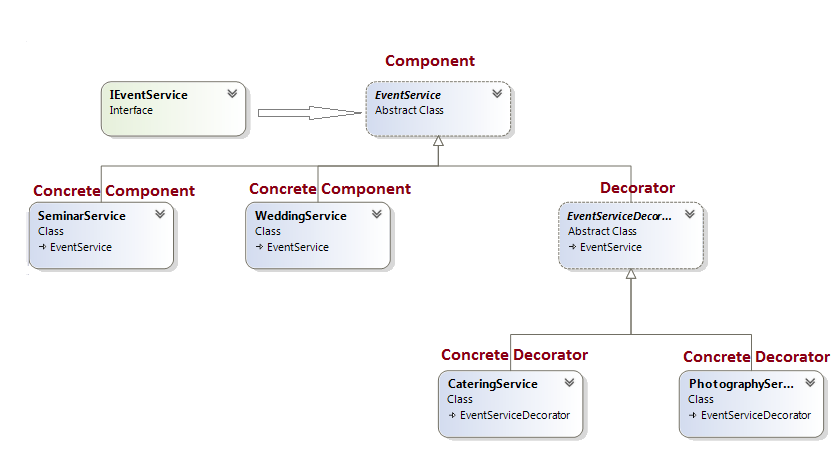

# Structural Patterns Homework #

## Decorator Pattern ##

----------

### Описание ###

Decorator Pattern служи за добавяне на функционалност на група от класове, които наследяват общ клас/интерфейс. Създаването на новите компоненти на всеки клас се осъществява чрез клас, който наследява общия интерфейс. Това елиминира нуждата от модификация на вече готовите класове, което спазва Open-Closed принципа -класовете са отворен за нови функционалности и затворени за промяна.

### Цел ###

Целта на шаблона е да добавя динамично нова функционалност. Решава проблема при наличието на твърде много наслесници - елеминиране на нуждата от модификация на всички съществуващи класове.

### Употреба ###

*  приложим при legacy sсистеми
*  при добавяне на UI controls
*  екстедване на sealed класове
*  CryptoStream и GZipStream decorates Stream
*  WPF Decorator class

### Структура на design pattern-a###

### Участници ###

*  Component -  интерфейсът на обектите, към които могат да се добавят допълнителни функционалности или качества динамично.
*  Concrete Component - обектът, към който ще се добавя нова функционалност.
*  Decorator - ази референция към компонент обекта и създава интерфейса, който съвпада с този на компонента.
*  Concrete Decorator - прибавя нови функционалности към обекта.

### Имплементация ###

Пример за използване на Decorator Pattern: създаване на EventService costs calculator.

**Class diagram:**

**Code:**

    public interface IEventService
    {
        decimal Cost { get; }
    }

    --------------------

    public abstract class EventService : IEventService
    {
        public abstract decimal Cost { get; }
    }

    --------------------

    public class WeddingService : EventService
    {
        public override decimal Cost
        {
            get
            {
                // Service charge for overall management
                return 10000;   
            }
        }
    }

    --------------------

    public abstract class EventServiceDecorator : EventService
    {
        private IEventService eventServiceObj;

        public EventServiceDecorator(IEventService eventService)
        {
            this.eventServiceObj = eventService;
        }

        public override decimal Cost
        {
            get
            {
                return this.eventServiceObj.Cost;
            }
        }
    }

    --------------------

    public class PhotographyService : EventServiceDecorator
    {
        public PhotographyService(IEventService eventService)
            : base(eventService)
        {
        }

        public override decimal Cost
        {
            get
            {
                // Cost of whatever event service represented by EventService + Photography service
                return base.Cost + 15000;
            }
        }
    }

    --------------------

    public class CateringService : EventServiceDecorator
    {
        public CateringService(IEventService eventService)
            : base(eventService)
        {
        }

        public override decimal Cost
        {
            get
            {
                // Cost of whatever event service represented by EventService + Catering service
                return base.Cost + 50000;
            }
        }
    }

    --------------------

    public class SeminarService : EventService
    {
        public override decimal Cost
        {
            get
            {
                // Service charge for overall management
                return 5000;   
            }
        }
    }

    --------------------

    public class EventsCostCalculatior
    {
        public static void Main(string[] args)
        {
            IEventService seminarService = new SeminarService();
            PhotographyService photographyService = new PhotographyService(seminarService);
            CateringService cateringService = new CateringService(photographyService);
            Console.WriteLine(cateringService.Cost);
        }
    }

       