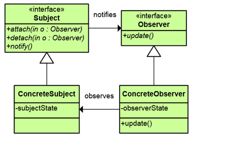
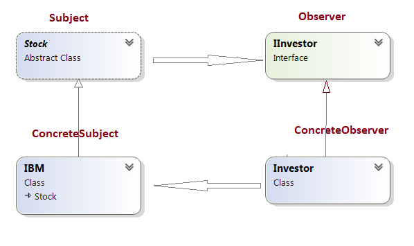

# Behavioral Patterns Homework #

## Observer Pattern ##

----------

### Описание ###

Дефинира зависимост "един към много" между обектите, така че ако един обект промени състоянието си, всички зависими от него обекти да бъдат известени и обновени автоматично.

### Цел ###

### Употреба ###

*  в C# events and event handlers
*  GUI, data binding, network events, etc.

### Структура на design pattern-a###

### Участници ###

*  Subject: 
   - knows its observers. Any number of Observer objects may observe a subject
   - provides an interface for attaching and detaching Observer objects.
*  Concrete Subject:
   - stores state of interest to ConcreteObserver
   - sends a notification to its observers when its state changes
*  Observer - defines an updating interface for objects that should be notified of changes in a subject.
*  Concrete Observer: 
   - maintains a reference to a ConcreteSubject object
   - stores state that should stay consistent with the subject's
   - implements the Observer updating interface to keep its state consistent with the subject's

### Имплементация ###

Пример за използване на Observer Pattern:

**Class diagram:**

**Code:**

    /// 

    /// The 'Subject' abstract class
    /// 

    public abstract class Stock
    {
        private string symbol;
        private double price;
        private List<IInvestor> investors = new List<IInvestor>();

        // Constructor
        public Stock(string symbol, double price)
        {
            this.symbol = symbol;
            this.price = price;
        }

        // Gets or sets the price
        public double Price
        {
            get 
            {
                return this.price; 
            }

            set
            {
                if (this.price != value)
                {
                    this.price = value;
                    this.Notify();
                }
            }
        }

        // Gets the symbol
        public string Symbol
        {
            get { return this.symbol; }
        }

        public void Attach(IInvestor investor)
        {
            this.investors.Add(investor);
        }

        public void Detach(IInvestor investor)
        {
            this.investors.Remove(investor);
        }

        public void Notify()
        {
            foreach (IInvestor investor in this.investors)
            {
                investor.Update(this);
            }
        }

    --------------------

    /// 

    /// The 'Observer' interface
    /// 

    public interface IInvestor
    {
        void Update(Stock stock);
    }

    --------------------

    /// 

    /// The 'ConcreteObserver' class
    /// 

    public class Investor : IInvestor
    {
        private string name;
        private Stock stock;

        // Constructor
        public Investor(string name)
        {
            this.name = name;
        }

        // Gets or sets the stock
        public Stock Stock
        {
            get { return this.stock; }
            set { this.stock = value; }
        }

        public void Update(Stock stock)
        {
            Console.WriteLine("Notified {0} of {1}'s " + "change to {2:C}", this.name, this.stock.Symbol, this.stock.Price);
        }
    }

    --------------------

    /// 

    /// The 'ConcreteSubject' class
    /// 

    public class IBM : Stock
    {
        // Constructor
        public IBM(string symbol, double price)
            : base(symbol, price)
        {
        }
    }

    --------------------

        /// 

        /// Entry point into console application.
        /// 

        public static void Main()
        {
            // Create IBM stock and attach investors
            IBM ibm = new IBM("IBM", 120.00);
            ibm.Attach(new Investor("Sorros"));
            ibm.Attach(new Investor("Berkshire"));

            // Fluctuating prices will notify investors
            ibm.Price = 120.10;
            ibm.Price = 121.00;
            ibm.Price = 120.50;
            ibm.Price = 120.75;
        }

